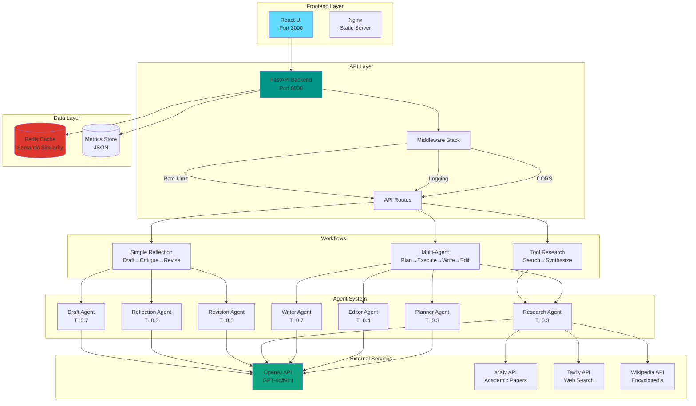
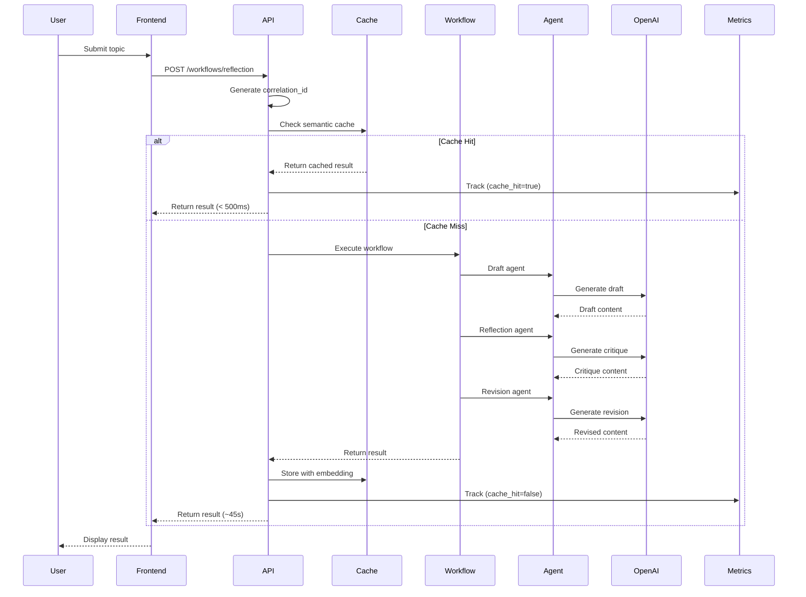
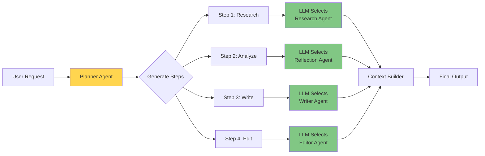

# Agentic AI Research Platform

Production-ready multi-agent system for automated research workflows. Built with FastAPI backend and React frontend, implementing advanced agentic patterns including reflection, tool integration, and intelligent orchestration.

## System Architecture



## Request Flow



## Multi-Agent Orchestration Flow



## Core Features

**Agent Workflows**
- Simple Reflection: Draft generation, critique, and revision cycle
- Tool-Enhanced Research: Integrated search across arXiv, Tavily, and Wikipedia with automated synthesis
- Multi-Agent Orchestration: Coordinated planning, research, writing, and editing pipeline

**Technical Stack**
- Backend: FastAPI with async support, OpenAI integration, structured logging
- Frontend: React with TailwindCSS, real-time monitoring, responsive design
- Integration: arXiv API, Tavily search, Wikipedia, OpenAI GPT-4/GPT-4o-mini
- Cache: Redis with semantic similarity matching (60-80% cost reduction)
- Rate Limiting: 100 requests/15min per IP (configurable)
- Export: HTML, Markdown, JSON formats

## System Architecture

```
backend/
├── app/
│   ├── agents/          # 7 specialized AI agents
│   ├── tools/           # External API integrations
│   ├── workflows/       # Orchestration logic
│   ├── api/routes/      # REST endpoints
│   └── models/          # Pydantic schemas
└── main.py              # FastAPI application

frontend/
├── src/
│   ├── components/      # Reusable UI components
│   ├── pages/           # Route handlers
│   └── services/        # API client layer
└── package.json
```

## Installation

**Requirements**
- Python 3.10+
- Node.js 18+
- Redis (for semantic caching)
- OpenAI API key
- Tavily API key (optional) 

**Backend Setup**
```bash
cd backend
python -m venv venv
.\venv\Scripts\activate  # Windows
pip install -r requirements.txt
```

**Environment Configuration**
Create `backend/.env`:
```env
OPENAI_API_KEY=sk-...
TAVILY_API_KEY=tvly-...
REDIS_URL=redis://localhost:6379
CACHE_ENABLED=True
RATE_LIMIT_REQUESTS=100
RATE_LIMIT_WINDOW_SECONDS=900
```

**Redis Setup** (Windows)
```powershell
# Install Redis via Chocolatey
choco install redis-64

# Or download from: https://github.com/microsoftarchive/redis/releases
# Start Redis
redis-server
```

**Frontend Setup**
```bash
cd frontend
npm install
```

## Running

**Option 1: Docker (Recommended)**
```bash
.\docker-start.ps1
```
All services start automatically: http://localhost:3000

**Option 2: Manual**

**Start Backend** (Terminal 1)
```bash
cd backend
.\venv\Scripts\activate
python main.py
```
Server runs on http://localhost:8000

**Start Frontend** (Terminal 2)
```bash
cd frontend
npm start
```
Application available at http://localhost:3000

See `DOCKER.md` for advanced Docker usage.

## API Usage

**Reflection Workflow**
```bash
curl -X POST http://localhost:8000/api/v1/workflows/reflection \
  -H "Content-Type: application/json" \
  -d '{"topic": "AI Ethics in Healthcare"}'
```

**Research Workflow**
```bash
curl -X POST http://localhost:8000/api/v1/workflows/tool-research \
  -H "Content-Type: application/json" \
  -d '{"topic": "Quantum Computing Applications", "tools": ["arxiv", "wikipedia"]}'
```

**Multi-Agent Workflow**
```bash
curl -X POST http://localhost:8000/api/v1/workflows/multi-agent \
  -H "Content-Type: application/json" \
  -d '{"topic": "Climate Change Modeling", "max_steps": 4}'
```

**API Documentation**
- Interactive docs: http://localhost:8000/docs
- Alternative view: http://localhost:8000/redoc

**Cache Management**
```bash
# Get cache statistics
curl http://localhost:8000/api/v1/cache/stats

# Invalidate all cache
curl -X DELETE http://localhost:8000/api/v1/cache/

# Disable cache (set in .env)
CACHE_ENABLED=False
```

## Rate Limiting

**Protection against API abuse:**
- Default: 100 requests per 15 minutes per IP
- Headers returned: `X-RateLimit-Limit`, `X-RateLimit-Remaining`, `X-RateLimit-Reset`
- 429 status when exceeded with `Retry-After` header
- Excludes health checks and documentation endpoints

**Test rate limiting:**
```powershell
.\test_rate_limit.ps1
```

**Adjust limits** in `.env`:
```env
RATE_LIMIT_REQUESTS=50      # Stricter for production
RATE_LIMIT_WINDOW_SECONDS=900  # 15 minutes
```

## Performance Metrics

**Track workflow performance:**
```bash
# Get metrics summary
curl http://localhost:8000/api/v1/metrics/summary
```

**Response includes:**
- Total requests and cache hit rate
- Average execution time
- Token usage and cost estimates
- Cost savings from caching
- Workflow breakdown by type

Metrics stored in `backend/metrics.json` for historical analysis.

## Semantic Caching

The platform includes intelligent semantic caching to reduce costs and latency:
- Reduces API costs by 60-80% for similar queries
- Improves response time from 45s to <500ms for cached results
- Uses sentence embeddings for semantic similarity matching (threshold: 0.95)
- 30-day TTL for cached results
- See `SEMANTIC_CACHING.md` for details

## Configuration

Configuration via `backend/.env`:
```env
# Models
DEFAULT_DRAFT_MODEL=gpt-4o
DEFAULT_REFLECTION_MODEL=gpt-4o-mini
DEFAULT_RESEARCH_MODEL=gpt-4o

# API Settings
MAX_SEARCH_RESULTS=5
MAX_WORKFLOW_STEPS=4
REQUEST_TIMEOUT=300

# Logging
LOG_LEVEL=INFO  # DEBUG, INFO, WARNING, ERROR
```

## Structured Logging

**JSON logs for production monitoring:**
- Every log entry is valid JSON
- Correlation IDs track requests across services
- Workflow context attached automatically
- Exception tracebacks included

**Log format:**
```json
{
  "timestamp": "2025-11-22T10:30:45Z",
  "level": "INFO",
  "logger": "app.api.routes.workflows",
  "message": "Starting reflection workflow",
  "correlation_id": "abc-123",
  "workflow_id": "workflow-456",
  "client_ip": "127.0.0.1",
  "duration_seconds": 12.5
}
```

**Use cases:**
- Parse with `jq` for filtering: `python main.py | jq 'select(.level=="ERROR")'`
- Export to log aggregators (Datadog, ELK, CloudWatch)
- Alert on error rates or slow requests

**View logs:**
```powershell
.\view_logs.ps1
```

## Testing

**Run unit tests:**
```powershell
.\run_tests.ps1
```

**Test coverage includes:**
- All 7 agents (draft, reflection, revision, research, writer, editor, planner)
- 3 workflows (simple reflection, tool research, multi-agent)
- API endpoints (health, workflows, cache, metrics)
- Middleware (rate limiting, logging)

**Coverage report:** Generated in `backend/htmlcov/index.html`

**Manual testing:**
```bash
# Install test dependencies
pip install pytest pytest-asyncio pytest-cov

# Run specific test file
pytest tests/test_agents.py -v

# Run with coverage
pytest tests/ --cov=app --cov-report=html
```

## CI/CD Pipeline

**Automated workflows via GitHub Actions:**

**Continuous Integration (on push/PR):**
- Backend: Run pytest with coverage, upload to Codecov
- Frontend: Build production bundle, validate
- Docker: Test image builds without pushing

**Continuous Deployment (on main push):**
- Auto-deploy backend to Render
- Auto-deploy frontend to Render  
- Health checks post-deployment
- Rollback on failure

**Setup:**
1. Add GitHub secrets (API keys, Render service IDs)
2. Configure Render services (see `DEPLOYMENT.md`)
3. Push to `main` branch triggers deployment

See `.github/CI_CD.md` for complete configuration guide.

## License

Proprietary License - Copyright (c) 2025 Abdoulaye Sall. All rights reserved.

See LICENSE file for details.
